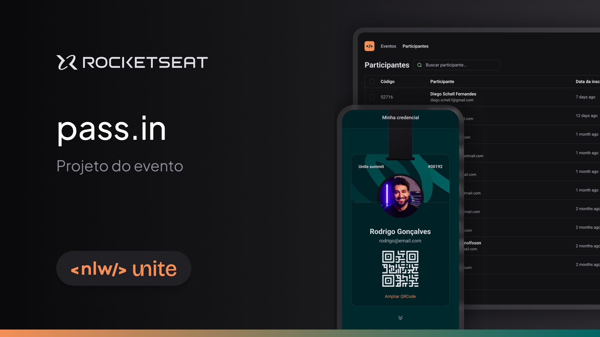
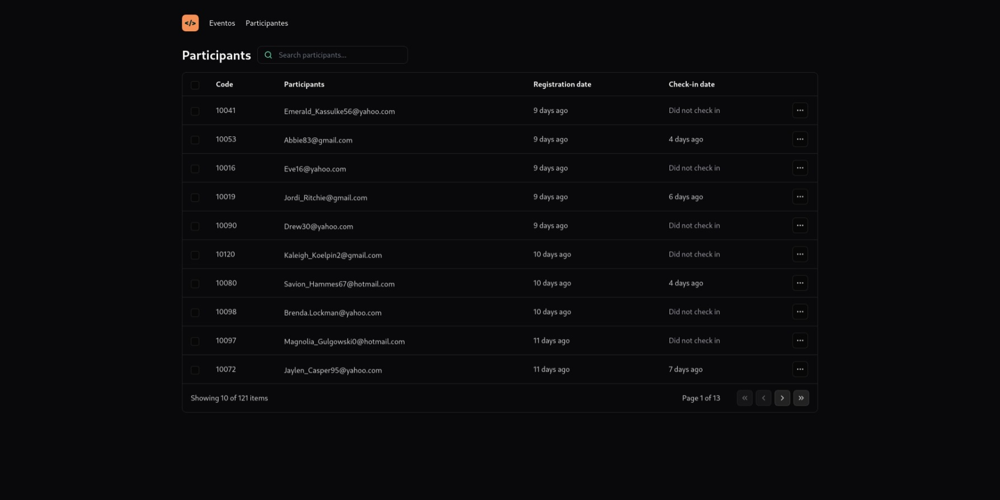

# NLW UNITE | PASS-IN

The pass.in is an application for **managing participants in face-to-face events**.

> Status: Finished... ✅ 

## Technologies 🚀

## License 📝

## About 💡

The tool allows the organizer to register an event and open a public registration page.

Registered participants can issue a credential for check-in on the day of the event.

The system will scan the participant’s credential to allow entry to the event.

